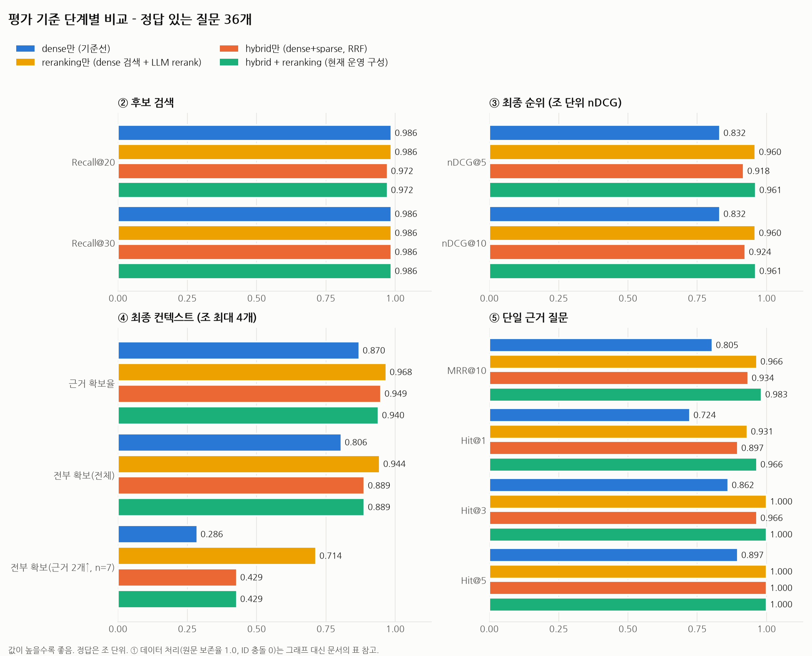
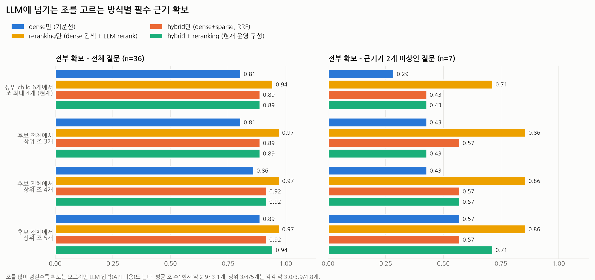
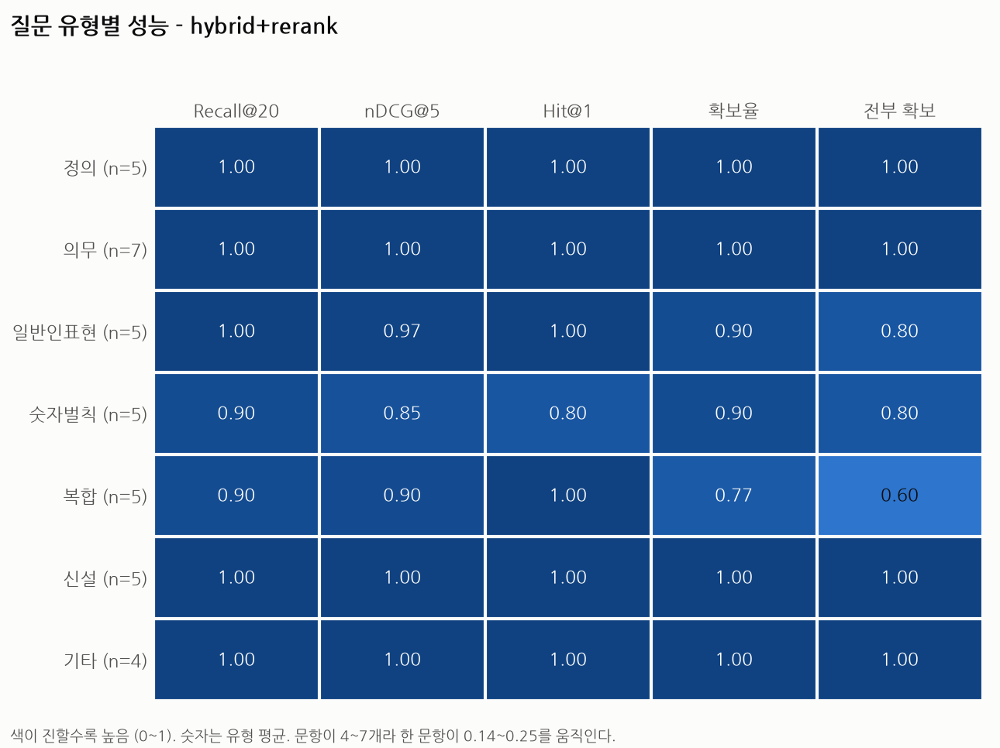
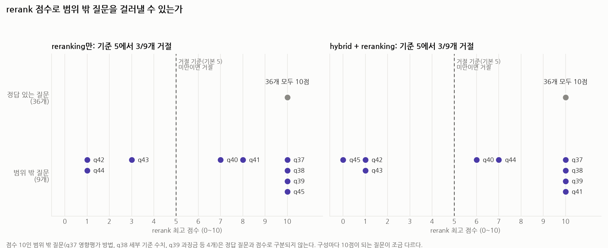

# UV 가상환경 설정 가이드

`notebook/`과 `app/`이 하나의 Python 가상환경을 공유하도록 구성한다.

## 1. 프로젝트 구조

```text
rag_minipjt/
│
├── .venv/
├── .env
├── .python-version
├── pyproject.toml
├── uv.lock
│
├── notebook/
│   └── test.ipynb
│
└── app/
    └── main.py
```

핵심은 다음과 같다.

- `.venv` : Python 가상환경
- `pyproject.toml` : 사용할 패키지 정의
- `uv.lock` : 실제 설치된 패키지 버전 고정
- `notebook/` : 실험 및 검증 코드
- `app/` : 실제 애플리케이션 코드

---

## 2. 프로젝트 초기화

프로젝트 루트에서 실행한다.

```bash
uv init --bare --python 3.12
```

---

## 3. 가상환경 생성

```bash
uv venv
```

가상환경은 프로젝트 루트의 `.venv/`에 생성된다.

필요한 경우 활성화한다.

```bash
source .venv/bin/activate
```

---

## 4. 필요한 패키지 설치

Qdrant, OpenAI Embedding, Notebook, FastAPI를 한 번에 설치한다.

```bash
uv add   openai   qdrant-client   python-dotenv   jupyter   ipykernel   fastapi   "uvicorn[standard]"
```

패키지를 설치하면 다음 파일이 자동으로 관리된다.

```text
pyproject.toml
uv.lock
```

---

## 5. 환경 복원

다른 PC 또는 수강생 환경에서는 다음 명령만 실행하면 동일한 환경을 만들 수 있다.

```bash
uv sync
```

`uv.lock`에 기록된 버전을 기준으로 패키지가 설치된다.

---

## 6. Notebook 실행

```bash
uv run jupyter lab
```

VS Code에서 `.ipynb`를 사용할 경우 `.venv`의 Python을 Kernel로 선택한다.

필요하면 Kernel을 등록한다.

```bash
uv run python -m ipykernel install --user --name rag-minipjt   --display-name "rag-minipjt"
```

---

## 7. FastAPI 실행

예를 들어 `app/main.py`를 다음과 같이 작성한다.

```python
from fastapi import FastAPI

app = FastAPI()


@app.get("/")
def root():
    return {
        "message": "RAG API"
    }
```

실행:

```bash
uv run uvicorn app.main:app --reload
```

브라우저:

```text
http://localhost:8000
```

API 문서:

```text
http://localhost:8000/docs
```

---

## 8. 패키지 추가

새로운 패키지가 필요하면 다음처럼 추가한다.

```bash
uv add 패키지명
```

예:

```bash
uv add langchain langchain-openai langchain-qdrant
```

---

## 9. Git 관리

`.gitignore`에는 다음 항목을 넣는다.

```gitignore
.venv/
.env
__pycache__/
.ipynb_checkpoints/
```

다음 파일은 Git에 포함한다.

```text
pyproject.toml
uv.lock
.python-version
```

---

## 핵심 정리

```text
프로젝트 루트
     │
     ├── pyproject.toml
     ├── uv.lock
     └── .venv
           │
      ┌────┴────┐
      │         │
 notebook/    app/
```

`notebook/`과 `app/`에 각각 별도의 가상환경을 만들지 않고  
**프로젝트 전체에서 하나의 `.venv`를 공유하는 방식이 가장 단순하다.**

---

## 10. common/ 공유 모듈 설정

`notebook/`과 `app/`에서 공통으로 쓰는 설정, Qdrant 클라이언트, 임베딩 로직은 `common/` 패키지로 분리한다.

```text
rag_minipjt/
└── common/
    ├── __init__.py
    ├── config.py      # 환경변수 로딩
    ├── qdrant.py       # Qdrant client 생성
    └── ai_model.py    # LLM / Embedding 모델 생성
```

`notebook/`은 프로젝트 루트가 아닌 `notebook/` 디렉토리에서 커널이 실행되기 때문에, `common`을 그냥 `.venv`에 패키지로 설치해두지 않으면 노트북에서 다음과 같은 오류가 발생한다.

```text
ModuleNotFoundError: No module named 'common'
```

이를 해결하기 위해 프로젝트 자체를 editable 패키지로 설치한다. `pyproject.toml`에 build-system을 추가한다.

```toml
[build-system]
requires = ["hatchling"]
build-backend = "hatchling.build"

[tool.hatch.build.targets.wheel]
packages = ["common", "app"]
```

그리고 `common/__init__.py`, `app/__init__.py`를 빈 파일로 만들어 패키지로 인식시킨다.

```bash
uv sync
```

`uv sync`를 실행하면 `rag-minipjt` 프로젝트 자체가 `.venv`에 editable 모드로 설치되어, 노트북이 어느 위치에서 실행되든 다음처럼 공통 모듈을 바로 사용할 수 있다.

```python
import os
from dotenv import load_dotenv
from common.ai_model import get_llm_model, get_embedding_model
from common.qdrant import get_qdrant_client
```

> `common/`의 코드를 수정한 뒤에는 커널만 재시작하면 되고, `uv sync`를 다시 실행할 필요는 없다 (editable 설치이므로 소스 변경이 즉시 반영된다).


---

## API 서버 (AI 기본법 QA)

법률을 잘 모르는 사용자가 질문하면 인공지능기본법 조문을 근거로 쉬운 말로 답하고, 근거 조문 원문을 함께 돌려준다. 법령에 근거가 없으면 지어내지 않고 답변을 거부한다.

```bash
# 1) Qdrant 실행 (docker-qdrant/ 참고) → 2) 법령 적재 (최초 1회) → 3) 서버 실행
uv run python -m rag.pipeline ingest
uv run uvicorn app.main:app --reload        # 문서: http://127.0.0.1:8000/docs
```

| 엔드포인트 | 설명 |
|---|---|
| `POST /ask` | `{"question": "..."}` → 답변, 인용 조항, 근거 조문 원문. 거부하면 `refused: true` |
| `GET /health` | Qdrant 연결과 법령 적재 여부 확인 (LLM·임베딩 API 호출 없음) |

```bash
curl -X POST localhost:8000/ask -H 'Content-Type: application/json' -d '{"question":"고영향 인공지능이란 무엇인가요?"}'
```

- `/ask` 한 번에 임베딩 1회 + LLM 2회(rerank, 답변)가 호출된다.
- 오류 응답: 입력 검증 실패 `422`, LLM 호출 한도 초과 `429`, LLM 서비스 오류 `502`, Qdrant 연결 실패 `503`.
- `.env`에 `LLM_API_KEY`, `LLM_BASE_URL`이 필요하다. 답변 거부 기준은 `RAG_MIN_RELEVANCE`(기본 5)로 조절한다.


---

## 평가 결과 요약

인공지능기본법(46개 조문)을 대상으로 직접 만든 골든셋(정답 있는 36문항 + 범위 밖 9문항)으로 검색 구성을 비교했다. 자세한 내용은 [docs/](docs/)를 참고한다.

### 검색 구성 비교 (정답 36문항)



| 지표 | dense만 | reranking만 | hybrid만 | **hybrid + reranking (운영)** |
|---|---|---|---|---|
| nDCG@5 | 0.832 | 0.960 | 0.918 | **0.961** |
| MRR@10 | 0.805 | 0.966 | 0.934 | **0.983** |
| Hit@1 | 0.724 | 0.931 | 0.897 | **0.966** |
| 근거 확보율 | 0.870 | **0.968** | 0.949 | 0.940 |

- **rerank의 효과가 가장 크다.** 순위 지표가 dense 대비 크게 오른다(nDCG@5 0.832 → 0.960).
- **hybrid는 rerank 없이는 도움이 되지만**, rerank를 붙이면 이점이 1문항 수준으로 줄어든다.
- 컨텍스트를 "상위 child 6개"가 아니라 **"상위 조 N개"로 고르면** 근거 확보가 올라간다(reranking만: 0.944 → 0.972). 기본값은 아직 바꾸지 않았다.
- 약한 유형은 **복합**(근거가 여러 조에 걸침)과 **숫자벌칙**이다.





### 청킹 실험

child 크기를 500자 → **300자**로 낮췄을 때 가장 안정적이었다(art@3 0.951 → 0.976, MRR 0.911 → 0.929, 나빠진 문항 없음). 조당 child 상한과 참조 풀기는 효과가 없어 채택하지 않았다.

### 답변 거부

- rerank 점수 기준(5점 미만 거부)은 범위 밖 질문 **3/9만** 거른다(정답 질문 오거절 0/36).


- 주제는 법에 있지만 구체 정보가 없는 질문(과징금 금액 등)은 점수로 못 거르므로 LLM 2차 거부에 맡긴다. **2차 거부와 답변 품질은 아직 평가하지 않았다.**

### 한계

- 표본이 작아(근거 2개 이상 질문은 7문항) 구성 간 1~2문항 차이는 우연일 수 있다.
- 정답 라벨은 직접 만들었고, q25 정답(제11조)은 재확인이 필요하다.

### 재현

```bash
uv run python -m eval.evaluate --report --configs dense,dense+rerank,hybrid,hybrid+rerank
```
